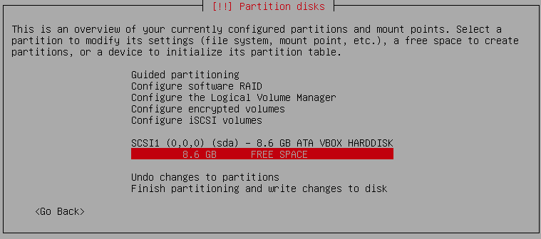

## Manual Partitioning

This is the step `Partition disks`. Partitioning method is `Manual`.

Select **the disk** to create an empty partition table.

Note, if you want to keep the existing data, select **the partition** instead. Flip `Use as: do not use` to `Use as: Ext4 journaling file system`. And then `Format the partition: no, keep existing data`. Lastly set up [the mount point and the mount options](#example-partitions).

Below shows a disk selected for creating a partition table.

Partition table type **gpt**.

Select **the free space** to set up the partitions.

Set up the partion with the correct format `Ext4 journaling`, mount point, and mount options.

### Example Partitions

You may notice the `discard` mount option for SSD drive.

| Drive               | Mount Point | Type | Size      | Mount Options                    | Other     |
|---------------------|-------------|------|-----------|----------------------------------|-----------|
| sda (256 GB SSD)    |             | EFI  | 256 MB    |                                  | Bootable  |
|                     | /           | EXT4 | 96 GB     | discard, relatime                |           |
|                     | /usr/local  | EXT4 | 32 GB     | discard, relatime, nodev         |           |
|                     | /opt        | EXT4 | 32 GB     | discard, relatime, nodev         |           | 
|                     | /home       | EXT4 | remaining | discard, relatime, nodev, nosuid |           |
| sdb (1 TB spinning) |             | SWAP | 128 GB    |                                  |           |
|                     | /var        | EXT4 | 128 GB    | relatime, nodev, nosuid          |           |
|                     | /tmp        | EXT4 | 128 GB    | relatime, nodev, nosuid, noexec  |           |
|                     | /data       | EXT4 | remaining | relatime, nodev, nosuid, noexec  |           |
| RAID10              | /samba      | EXT4 | 4 TB      | relatime, nodev, nosuid, noexec  | largefile |

Another example for larger disks.

| Drive               | Mount Point | Type | Size      | Mount Options                    | Other         |
|---------------------|-------------|------|-----------|----------------------------------|---------------|
| sda (512 GB NVME)   |             | EFI  | 512 MB    |                                  | Bootable      |
|                     | /           | EXT4 | 128 GB    | discard, relatime                |               |
|                     | /usr/local  | EXT4 | 96 GB     | discard, relatime, nodev         |               |
|                     | /opt        | EXT4 | 96 GB     | discard, relatime, nodev         |               | 
|                     | /home       | EXT4 | remaining | discard, relatime, nodev, nosuid |               |
| sdb (2 TB spinning) |             | SWAP | 196 GB    |                                  | 128 GB memory |
|                     | /var        | EXT4 | 256 GB    | relatime, nodev, nosuid          |               |
|                     | /tmp        | EXT4 | 256 GB    | relatime, nodev, nosuid, noexec  |               |
|                     | /data       | EXT4 | remaining | relatime, nodev, nosuid, noexec  |               |
| RAID10              | /samba      | EXT4 | 4 TB      | relatime, nodev, nosuid, noexec  | largefile     |

Finally it lets you review the partitions. Scroll to the bottom of the review list, choose `Finish partitioning and write changes to disk`.

Note one use of the partition mounted at `/data` is to link the datasets folder of project, e.g. `/data/<usr>/<project>` linked to `~/Workspace/<project>/datasets`.

### Software RAID

First, let's talk briefly about hardware RAID. If you have set up RAID in the BIOS and have correctly edited the command `Expert install`, the RAID should appear here as a single disk. Partition it as if it is a single disk. Again this is for setting up a hardware RAID.

Now software RAID is different from hardware RAID. See the screenshot below for software RAID.

Software RAID is the preferred RAID. There is an option `Configure software RAID` (the first blue box in the screenshot). Once set, the RAID will appear as a single disk (the second blue box). The third blue box list the disks composing the RAID. **Do not touch them**.

If you have a previously set software RAID, as the RAID configuration is written on the disks, it should show up here as a single device. You do not need to configure the RAID again. For example, mine just shows up as `RAID10 device #0`. It is from a previous install.

**You can keep the data already on the RAID device**. Here is how: Select the partition (not the disk) on the RAID disk. Flip `Use as: do not use` to `Use as: Ext4 journaling file system` and `Format the partition: no, keep existing data`. Set up the mount point and mounting options.

In fact, this applied not only to RAID partitions but also to any partition. Note, even if we keep the existing data, we still need to mount the partition and set the mount options (see the above table). The exception is the swap partition. It is already marked as `F` (format it) and nothing needs to be done for it.

### Other Notes, Links

1. About partitions
    * [Partitioning - Arch Linux Wiki](https://wiki.archlinux.org/index.php/Partitioning)
    * [The importance of Linux partitions](http://www.cyberciti.biz/tips/the-importance-of-linux-partitions.html)
    * [Partitioning Your Hard Drive](http://www.skorks.com/2009/08/partitioning-your-hard-drive-during-a-linux-install/)
    * [Recommended Partitioning Scheme - fedora 19](https://docs.fedoraproject.org/en-US/Fedora/19/html/Installation_Guide/s2-diskpartrecommend-x86.html)
    * [Recommended Partitioning Scheme - fedora 25](https://docs.fedoraproject.org/en-US/Fedora/25/html/Installation_Guide/sect-installation-gui-manual-partitioning-recommended.html)
2. What should NOT be on separate partitions
    * The root `/` has `/bin`, `/etc`, `/lib` and they should be kept on the same partition.
    * Also avoid mounting `/usr` on a separate partition. Nowadays, the `/usr` directory has most of the system installed binaries, kernel source tree (e.g. Arch Build Tree), documentations.
3. Recommended partitions
    * `/usr/local` installs packages, built by the user (via `make install`), outside the system's package manager.
    * `/opt` installs self-contained packages.
    * `/var` package cache (note that packages may be executed here, so do not set the `no exec` flag), spool (for mail, printing), logs.
4. Useful commands
    * `fdisk -l` or `gdisk -l` to list partitions.
    * `mkfs` to build a Linux file system on a hard disk partition.
    * `lsblk` to list block devices. It reads the `sysfs` file to gather the information.
    * `less /etc/fstab` to view the file system tabs.
5. SSD Notes
    * [Solid State Drives - Arch Linux Wiki](https://wiki.archlinux.org/index.php/Solid_State_Drives)
